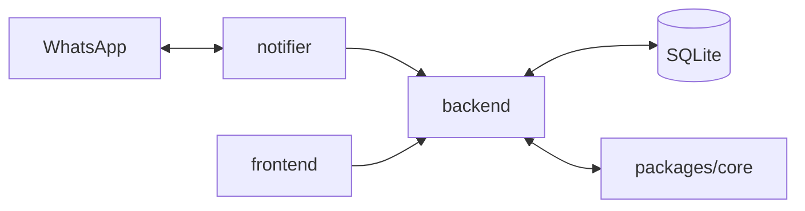

# [monorepo]: seller

[](https://github.com/totallynotdavid/chatbot/actions/workflows/codeql.yml)

A WhatsApp sales bot. Conversations are bot-driven, employees manage products, stock and sales from a web dashboard, and the bot escalates to a human only when a client asks for it. The bot's conversational logic is a pure state machine in `packages/core` that returns commands for the backend to execute. The backend, notifier and dashboard have no business logic, only transport.



## Apps & packages

Apps:

- `apps/backend`, Hono on Bun with `bun:sqlite`. Webhook ingest, command executor, REST API for the dashboard.
- `apps/frontend`, SvelteKit 5 dashboard. Conversations, catalog, analytics, simulator.
- `apps/notifier`, async WhatsApp queue. Sends messages out and forwards incoming ones to the backend.

Packages:

- `packages/core`, the conversation state machine and command pattern. All business rules live here. The phases are in `packages/core/src/conversation/phases/`, eligibility rules in `packages/core/src/eligibility/`.
- `packages/intelligence`, LLM helpers used by the backend (eligibility parsing, question detection, escalation hints).
- `packages/logger`, shared pino logger.
- `packages/types`, shared types for conversations, commands, catalog, segments.
- `packages/utils`, misc helpers.
- `packages/tsconfig`, shared tsconfig bases.

## Get started

Prereqs are pinned in `mise.toml` (bun, cloudflared, biome). Install them with `mise install`.

```sh
bun install
cp .env.example .env
# edit .env, then:
cd apps/backend && bun run seed
cd ../.. && bun run dev
```

`bun run dev` starts the backend, notifier and frontend in parallel. Run them individually with `bun run dev:backend`, `dev:notifier`, `dev:frontend`. For local WhatsApp webhook testing, `bun run dev:tunnel` exposes the frontend through a cloudflared quick tunnel (URL written to `.cloudflare-url`).

Database lives at `apps/backend/data/database.sqlite` (gitignored). Static uploads at `apps/backend/data/uploads/catalog/<segment>/<category>/` (also gitignored). Schema is in `apps/backend/src/db/schema.sql`, seed data in `apps/backend/src/db/seed-data/`.

## Read this first

Start here when you're new to the code:

- Webhook entry point: `apps/backend/src/routes/webhook.ts`
- Webhook consumer: `apps/backend/src/conversation/index.ts`
- State machine: `packages/core/src/conversation/transition.ts`
- Eligibility (FNB, GASO): `packages/core/src/eligibility/`
- Command executor: `apps/backend/src/conversation/handler/command-executor.ts`
- Enrichment loop (LLM-backed): `apps/backend/src/conversation/handler/enrichment-loop.ts`
- Auth, sessions, RBAC: `apps/backend/src/middleware/auth.ts`, `apps/backend/src/platform/auth/session.ts`
- Database bootstrap and schema: `apps/backend/src/db/init.ts`, `apps/backend/src/db/schema.sql`
- Frontend API client: `apps/frontend/src/lib/utils/api.ts`
- Architecture and principles: `.github/copilot-instructions.md`, `.github/bot-architecture.md`
- Deployment: `deployment/deploy.sh`, `ecosystem.config.js`

## Validation

```sh
bun run format        # biome format + lint
bun test              # packages/core and apps/backend
bun run test:llm      # backend LLM service tests
cd apps/frontend && bun run check   # svelte-check
```
