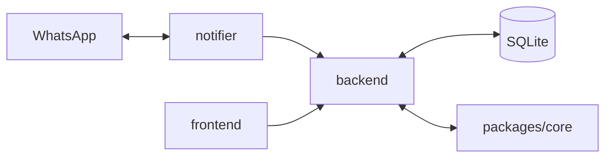

# [monorepo]: seller

[](https://github.com/totallynotdavid/chatbot/actions/workflows/codeql.yml)

A multi-business WhatsApp sales bot. Conversations are bot-driven, employees
manage products, stock and sales from a web dashboard, and the bot escalates to
a human only when a client asks for it. The bot's conversational logic is a pure
state machine in `packages/core` that returns commands for the backend to
execute. The backend, notifier and dashboard have no business logic, only
transport.

Every business is a **tenant**. A tenant owns one or more **channel accounts**
(one WhatsApp number each), and all of its data - conversations, catalog,
orders, analytics - is scoped to it. Inbound webhooks are routed to a tenant by
Meta's `metadata.phone_number_id`; outbound sends use that account's encrypted
credentials. Users belong to tenants through a membership that carries their
role. VendeYa's own staff are **platform operators**: members of no tenant, able
to act across all of them for support.


```mermaid
flowchart LR
    wa[WhatsApp] <--> notifier
    notifier --> backend
    backend <--> sqlite[(SQLite)]
    backend <--> core[packages/core]
    frontend --> backend
```

## Apps & packages

Apps:

- `apps/backend`, Hono on Bun with `bun:sqlite`. Webhook ingest, command
  executor, REST API for the dashboard.
- `apps/frontend`, SvelteKit 5 dashboard. Conversations, catalog, analytics,
  simulator.
- `apps/notifier`, async WhatsApp queue. Sends messages out and forwards
  incoming ones to the backend.

Packages:

- `packages/core`, the conversation state machine and command pattern. All
  business rules live here. The phases are in
  `packages/core/src/conversation/phases/`, eligibility rules in
  `packages/core/src/eligibility/`.
- `packages/intelligence`, LLM helpers used by the backend (eligibility parsing,
  question detection, escalation hints).
- `packages/logger`, shared pino logger.
- `packages/types`, shared types for conversations, commands, catalog, segments.
- `packages/utils`, misc helpers.
- `packages/tsconfig`, shared tsconfig bases.

## Get started

Prereqs are pinned in `mise.toml` (bun, cloudflared, biome). Install them with
`mise install`.

```sh
bun install
cp .env.example .env
# edit .env - SECRETS_KEY is new, see below
bun run seed
bun run account create <username>   # or --platform-operator, see below
bun run dev
```

The seed ships **no credentials** and creates no accounts, and neither does boot
or a migration. Accounts are created and promoted only by the operator command
`bun run account`:

- `bun run account create <username> [--platform-operator | --tenant <tenantId>] [--name <display name>]`
  creates an account: an admin of the tenant given by `--tenant` (optional when
  exactly one tenant exists), or with `--platform-operator` VendeYa staff, who
  belong to no tenant and can act across all of them. The two flags exclude each
  other.
- `bun run account promote <username>` makes an existing, active account a
  platform operator. It keeps its tenant memberships, and promoting an account
  that already is one changes nothing.

The password is read from a hidden prompt, asked twice, or from stdin when stdin
is not a terminal (`cat password.txt | bun run account create <username>`). It
is never taken from arguments or the environment, and must be at least 12
characters. Boot logs a warning while the database has no platform operator.

`SECRETS_KEY` (32 bytes, hex or base64) encrypts WhatsApp tokens at rest -
without it a channel account is created in `pending` state with no credentials
and cannot send.

An existing single-business database migrates itself on first boot: the tenant
and channel account are created from the `WHATSAPP_*` variables - through the
same seed a fresh database runs, so the token is imported and encrypted exactly
as it would be there - and every existing row is stamped with them, so that
business behaves exactly as before. Nobody is promoted to platform operator; run
`bun run account promote <username>` for the account that should onboard the
next tenant. See `apps/backend/src/db/migrations.ts`.

`bun run dev` starts the backend, notifier and frontend in parallel. Run them
individually with `bun run dev:backend`, `dev:notifier`, `dev:frontend`. For
local WhatsApp webhook testing, `bun run dev:tunnel` exposes the frontend
through a cloudflared quick tunnel (URL written to `.cloudflare-url`).

Database lives at `apps/backend/data/database.sqlite` (gitignored). Schema is in
`apps/backend/src/db/schema.sql`, seed data in `apps/backend/src/db/seed-data/`.

Uploads split by who may read them:

- `apps/backend/data/uploads/images/` holds catalog images and is served
  unauthenticated at `/media/images/*`. That is deliberate: when we send an
  image message, Meta fetches the link from its own servers with no credentials.
  Ids are random, and the `assets` row still records the owning tenant. The
  photos the base catalog is seeded with are tracked in git here, and every boot
  copies any that are missing onto the configured images directory
  (`apps/backend/src/db/seeds/images.ts`), so a deployment whose uploads live on
  a volume serves them too.
- `apps/backend/data/private/<tenant>/` holds signed contracts and call
  recordings. Nothing serves that directory; the bytes are reachable only
  through `/api/assets/:id`, which checks the caller's tenant scope first.

Both paths above are the development defaults, not fixed locations: they are
derived from `UPLOAD_DIR` in `apps/backend/src/lib/storage-paths.ts`, and in
production that points at a persistent volume while the working directory is
replaced on every redeploy. Take the roots from that module rather than joining
them onto `process.cwd()` — `apps/backend/tests/storage-path-guard.test.ts`
fails the build if anything builds its own, which it has done twice.

## Read this first

Start here when you're new to the code:

- Webhook entry point:
  [`apps/backend/src/routes/webhook.ts`](https://github.com/totallynotdavid/chatbot/blob/master/apps/backend/src/routes/webhook.ts)
- Webhook consumer:
  [`apps/backend/src/conversation/index.ts`](https://github.com/totallynotdavid/chatbot/blob/master/apps/backend/src/conversation/index.ts)
- State machine:
  [`packages/core/src/conversation/transition.ts`](https://github.com/totallynotdavid/chatbot/blob/master/packages/core/src/conversation/transition.ts)
- Eligibility (FNB, GASO):
  [`packages/core/src/eligibility/`](https://github.com/totallynotdavid/chatbot/tree/master/packages/core/src/eligibility)
- Command executor:
  [`apps/backend/src/conversation/handler/command-executor.ts`](https://github.com/totallynotdavid/chatbot/blob/master/apps/backend/src/conversation/handler/command-executor.ts)
- Enrichment loop (LLM-backed):
  [`apps/backend/src/conversation/handler/enrichment-loop.ts`](https://github.com/totallynotdavid/chatbot/blob/master/apps/backend/src/conversation/handler/enrichment-loop.ts)
- Auth, sessions, tenant scope, RBAC:
  [`apps/backend/src/middleware/auth.ts`](https://github.com/totallynotdavid/chatbot/blob/master/apps/backend/src/middleware/auth.ts),
  [`apps/backend/src/platform/auth/session.ts`](https://github.com/totallynotdavid/chatbot/blob/master/apps/backend/src/platform/auth/session.ts),
  [`apps/backend/src/platform/auth/scope.ts`](https://github.com/totallynotdavid/chatbot/blob/master/apps/backend/src/platform/auth/scope.ts)
- Tenants, memberships, channel accounts:
  [`apps/backend/src/domains/tenants/index.ts`](https://github.com/totallynotdavid/chatbot/blob/master/apps/backend/src/domains/tenants/index.ts),
  [`apps/backend/src/domains/channels/accounts.ts`](https://github.com/totallynotdavid/chatbot/blob/master/apps/backend/src/domains/channels/accounts.ts)
- Database bootstrap and schema:
  [`apps/backend/src/db/init.ts`](https://github.com/totallynotdavid/chatbot/blob/master/apps/backend/src/db/init.ts),
  [`apps/backend/src/db/schema.sql`](https://github.com/totallynotdavid/chatbot/blob/master/apps/backend/src/db/schema.sql)
- Frontend API client:
  [`apps/frontend/src/lib/utils/api.ts`](https://github.com/totallynotdavid/chatbot/blob/master/apps/frontend/src/lib/utils/api.ts)
- Architecture and principles:
  [`.github/copilot-instructions.md`](https://github.com/totallynotdavid/chatbot/blob/master/.github/copilot-instructions.md),
  [`.github/bot-architecture.md`](https://github.com/totallynotdavid/chatbot/blob/master/.github/bot-architecture.md)

## Validation

```sh
bun run format        # biome format + lint
bun test              # packages/core and apps/backend
bun run test:llm      # backend LLM service tests
cd apps/frontend && bun run check   # svelte-check
```
